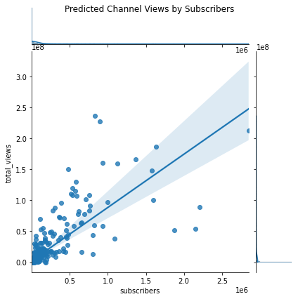

## Analysis of YouTube Channel Growth

The goal of this project is to better understand which factors are most important in driving channel views, and how those factors relate to monetizing a YouTube Channel.

To start exploring this goal, I used a linear regression model with one feature to describe Total Channel View (total_views) as a function of the Subscribers.

The figure suggests that subscribers may have a positive impact on a channel's viewership.